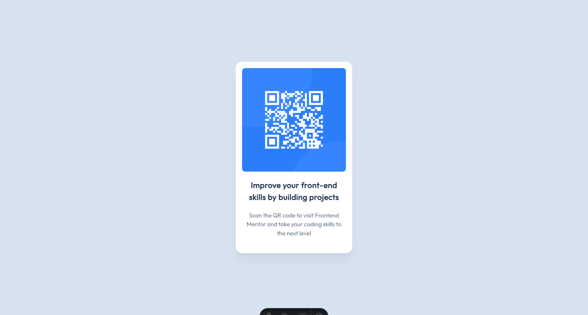

# 🧩 Proyecto: Componente QR Code

Este proyecto consiste en el desarrollo de un **componente de Código QR** utilizando **Astro** y **Tailwind CSS**.  
El objetivo es aplicar los conocimientos sobre **componentes**, **maquetación**, **estilos responsivos** y **utilidades CSS** para construir un diseño limpio, moderno y adaptable a diferentes dispositivos.

---

## 📖 Descripción general

### 🧩 Vista previa del proyecto

---

### 🔗 Enlaces del proyecto

- **Repositorio en GitHub:** [Link del repositorio](https://github.com/ArantzaGHdz/Ejercicio_QR-Code-Component)
- **Sitio desplegado (opcional):** [Link del deploy](https://)

---

## 🧠 Proceso de desarrollo

### 🛠️ Tecnologías utilizadas

- [Astro](https://astro.build)
- [Tailwind CSS](https://tailwindcss.com/)
- HTML5 semántico
- Diseño responsivo (Mobile-first)
- Componentes reutilizables

---

### 💡 Lo que aprendí

Al ser el primer proyecto de Astro que realizo por mi cuenta como tarea, aprendí a crear componentes y llamarlos dentro de la página principal; además de aprender e investigar sobre las clases de Tailwind y como aplicarlas en los elementos que conforman los componentes, la guía de Tailwind oficial sirvió mucho para este último. Reforce mis conocimientos sobre la sintaxis de CSS y HTML.

---

### 🚀 Áreas de mejora

Tuve problemas para implementar los colores personalizados de la guía de diseño, habían varias opciones para usarlas con el perfil de color HSL pero esos métodos recurrian a modificar configuraciones de la página (lo cual me daba miedo de tocar al no tener conocimientos de como hacerlo sin afectar al proyecto). Al final, en el mismo archivo de estilos ('global.css'), los implemente pero reconozco que esto no es factible en páginas que utilicen diferentes colores para una misma categoría de elementos, tales como párrafos o títulos.

---

### 📚 Recursos útiles

- [Guía oficial de Tailwind CSS](https://tailwindcss.com/docs)

---

### 👩‍💻 Autor

- **Nombre completo:** Arantza Darina Gómez Hernández
- **Carrera:** Ingeniería en Tecnologías de la Información y las Comunicaciones
- **Grupo:** TC1
- **Correo institucional:** 23151198@aguascalientes.tecnm.mx

---

### ✨ Reflexión final

- ¿Qué fue lo más fácil o lo más difícil de realizar?
  Lo más dificil de realizar fue la utilización de Tailwind para modificar el diseño de la página, tenía conocimientos previos de la sintaxis de CSS pero ahora utilizarlos por este medio con los términos sintetizados y aplicandolos en una clase para cada elemento lo volvió más complejo; por suerte hay recursos en línea como la guía oficial de Tailwind con cada utilidad y videos que pueden ayudar para casos específicos.

- ¿Qué parte disfrutaste más del desarrollo?
  El diseño de la pagina web, siempre me ha gustado hacer diseño de frontend

- ¿Qué conceptos nuevos aprendiste?
  Aprendí sobre componentes, layouts y Tailwind junto con sus respectivas utilidades

- ¿Cómo aplicarías lo aprendido en proyectos futuros?
  Al ser la primera experiencia que tengo con Astro, puedo aplicar todo el conocimiento general que he conseguido para crear proyectos de manera más sencilla y organizada con este framework
